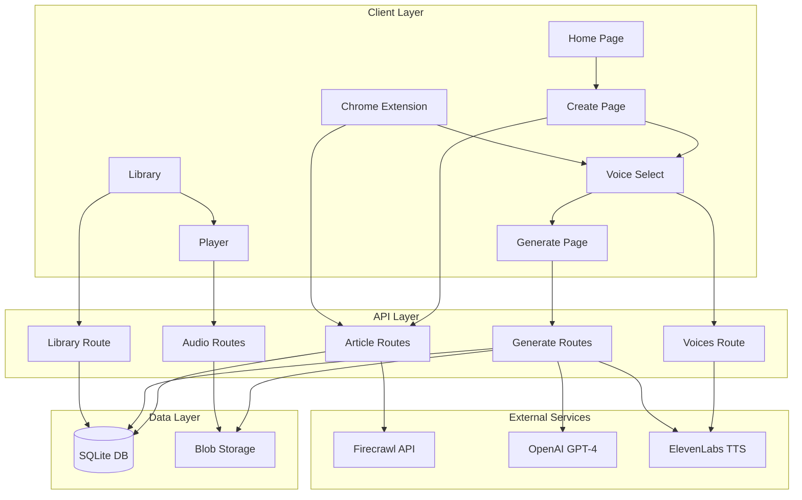
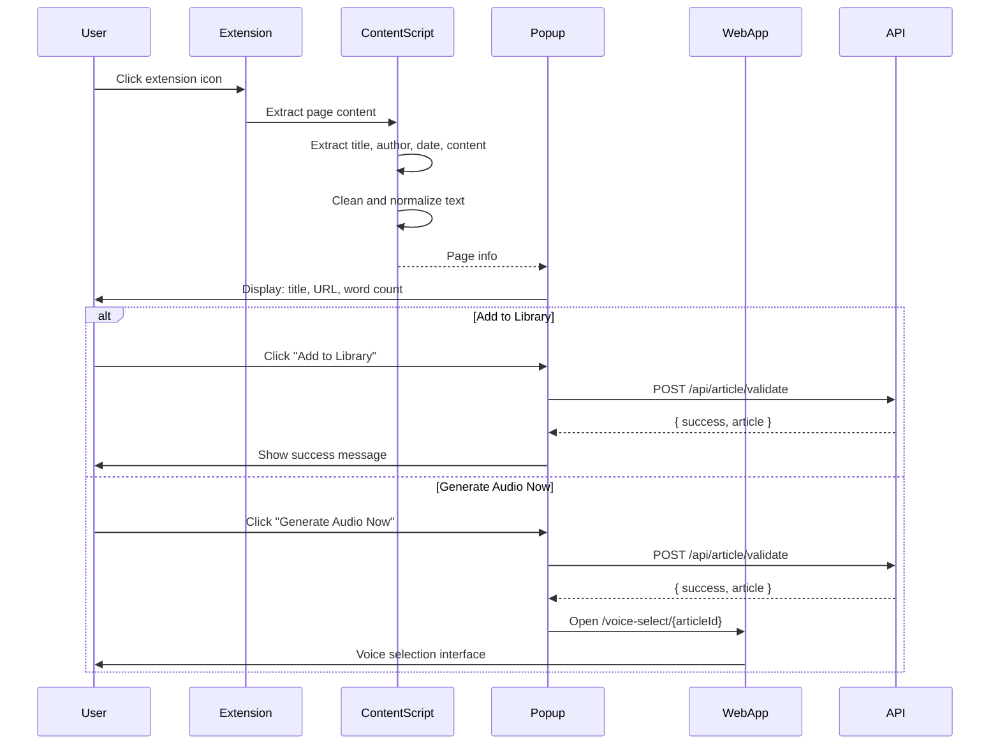
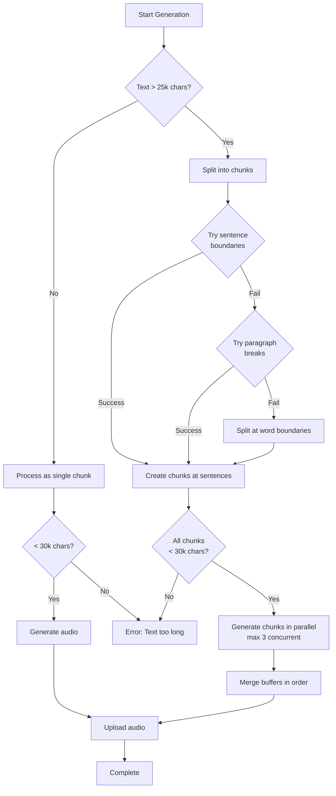

# TTS Article Reader - Codebase Map

> Auto-generated by Cartographer. Last mapped: January 24, 2026

## System Overview

TTS Article Reader is a Next.js 16 application that converts web articles into natural-sounding audio using AI text-to-speech. The application features a retro terminal aesthetic with phosphor green/cyan color scheme and integrates three external APIs: Firecrawl (article scraping), OpenAI (text enhancement), and ElevenLabs (TTS generation).



## Directory Structure

```
tts-article-reader/
├── app/                          # Next.js App Router pages and layouts
│   ├── api/                      # API route handlers
│   │   ├── article/              # Article scraping and validation
│   │   ├── audio/                # Audio metadata endpoints
│   │   ├── enhance/              # Text enhancement endpoint
│   │   ├── generate/             # Audio generation with SSE streaming
│   │   ├── library/              # Library data fetching
│   │   └── voices/               # ElevenLabs voice listing with cache
│   ├── create/                   # Article input page (URL or paste)
│   ├── generate/[articleId]/    # Real-time generation with progress tracking
│   ├── library/                  # Saved articles with audio library
│   ├── player/[audioId]/        # Full-featured audio player with visualizer
│   ├── storage/audio/           # Local audio file serving
│   ├── voice-select/[articleId]/ # Voice selection with preview and settings
│   ├── globals.css              # Global styles, animations, color system
│   ├── layout.tsx               # Root layout
│   └── page.tsx                 # Home/landing page
├── chrome-extension/            # Chrome extension for article extraction
│   ├── icons/                   # Extension icons
│   ├── scripts/                 # Background, content, and popup scripts
│   ├── manifest.json            # Extension manifest v3
│   ├── popup.html               # Extension popup UI
│   └── README.md                # Extension documentation
├── components/                  # React components
│   ├── terminal/                # Terminal-aesthetic components (legacy)
│   └── ui/                      # shadcn/ui component library
├── lib/                         # Shared libraries and utilities
│   ├── api/                     # External API clients
│   │   ├── elevenlabs.ts       # ElevenLabs TTS integration
│   │   ├── firecrawl.ts        # Article scraping + image extraction
│   │   └── openai.ts           # Text enhancement with streaming
│   ├── db/                      # Database layer
│   │   ├── client.ts           # SQLite connection singleton
│   │   └── schema.ts           # Drizzle ORM schema definitions
│   ├── storage/                 # File storage abstraction
│   │   └── blob-storage.ts     # Local/Vercel Blob storage
│   ├── rate-limit.ts           # In-memory rate limiting
│   ├── utils.ts                # Utility functions
│   └── voice-names.ts          # Voice ID → Display name mappings
├── public/                      # Static assets
├── drizzle.config.ts           # Drizzle ORM configuration
├── next.config.ts              # Next.js configuration
├── package.json                # Dependencies and scripts
├── tsconfig.json               # TypeScript configuration
└── README.md                   # Project documentation
```

## Module Guide

### Database Module (`lib/db/`)

**Purpose**: SQLite database access with Drizzle ORM for managing articles, audio files, voices, and processing jobs.

**Key files**:
| File | Purpose | Tokens |
|------|---------|--------|
| `schema.ts` | Database schema definitions (4 tables) | 916 |
| `client.ts` | Database connection singleton | 57 |

**Data Models**:
- **articles**: Stores original and enhanced text, metadata, source info
- **audioFiles**: Generated audio files with status tracking (FK to articles)
- **voices**: Cached ElevenLabs voices (1-hour TTL)
- **processingJobs**: Background job tracking for long-running generations

**Exports**:
```typescript
// From schema.ts
export { articles, audioFiles, voices, processingJobs }
export type { Article, AudioFile, Voice, ProcessingJob }

// From client.ts
export { db } // Drizzle database instance
```

**Dependencies**: `drizzle-orm`, `better-sqlite3`

**Patterns**:
- Cascade deletion: Audio files deleted when parent article is deleted
- Type inference with `$inferSelect` and `$inferInsert`
- Indexed columns for query performance (`createdAt`, `articleId`, `status`)

**Gotchas**:
- Voice cache must be manually invalidated (1-hour TTL)
- Processing jobs table allows resuming after browser close

---

### External API Integration (`lib/api/`)

**Purpose**: Unified interface to external services (ElevenLabs, Firecrawl, OpenAI)

**Key files**:
| File | Purpose | Tokens |
|------|---------|--------|
| `elevenlabs.ts` | Text-to-speech generation | 654 |
| `firecrawl.ts` | Article scraping and image extraction | 803 |
| `openai.ts` | Text enhancement with streaming | 298 |

#### ElevenLabs API (`elevenlabs.ts`)

**Exports**:
```typescript
getVoices(): Promise<VoicesResponse>
generateSpeech(options: TTSOptions): Promise<Response>
```

**Configuration**:
- Model: `eleven_turbo_v2_5`
- Default settings: `{ stability: 0.5, similarity_boost: 0.8, style: 0.0 }`
- Output format: `mp3_44100_128`
- Character limit: 30,000 per request

**Gotchas**: Parses ElevenLabs error responses and adds context for character limit errors

#### Firecrawl API (`firecrawl.ts`)

**Exports**:
```typescript
scrapeArticle(url: string): Promise<FirecrawlResponse>
extractWordCount(text: string): number
extractFeaturedImage(metadata): string | null
```

**Configuration**:
- API version: v2
- `onlyMainContent: true` (removes navigation, ads, etc.)
- `maxAge: 172800000` (2-day cache)

**Image Extraction Priority**:
1. Open Graph (`og:image`)
2. Twitter Card (`twitter:image`)
3. Schema.org structured data
4. Generic `metaImage`

#### OpenAI API (`openai.ts`)

**Exports**:
```typescript
enhanceText(text: string): AsyncIterable<string>
```

**Enhancement Strategy**:
- Model: `gpt-4o-mini`
- Temperature: 0.3 (conservative)
- Adds `[pause]` tags, fixes punctuation, breaks long sentences
- **Important**: Only modifies punctuation/pacing, preserves meaning

---

### Storage Module (`lib/storage/`)

**Purpose**: File storage abstraction for audio files

**Key files**:
| File | Purpose | Tokens |
|------|---------|--------|
| `blob-storage.ts` | Local/Vercel Blob storage interface | 180 |

**Exports**:
```typescript
uploadAudio(buffer: Buffer, filename: string): Promise<string>
getAudioPath(filename: string): string
```

**Storage Location**: `./storage/audio/` (development)

**Pattern**: Creates directory structure on demand with `ensureStorageDir()`

**Production**: Should use Vercel Blob instead of local filesystem

---

### Utility Modules (`lib/`)

#### Rate Limiting (`rate-limit.ts`)

**Purpose**: In-memory rate limiting with sliding window algorithm

**Exports**:
```typescript
rateLimit(identifier: string, options: RateLimitOptions): RateLimitResult
getClientIp(request: Request): string
formatRateLimitError(reset: number): string
```

**Limits**:
- Scraping: 10/hour per IP
- Generation: 5/hour per IP
- Preview: 20/hour per IP

**Gotchas**: In-memory implementation; production should use Vercel KV

#### Voice Names (`voice-names.ts`)

**Purpose**: Human-readable voice name mappings

**Pattern**: `Record<voiceId, displayName>` with 22+ premade ElevenLabs voices

**Example**: `"EXAVITQu4vr4xnSDxMaL": "Sarah - Mature, Confident"`

#### Utils (`utils.ts`)

**Purpose**: Tailwind CSS class merging utility

**Export**: `cn(...inputs)` - Combines `clsx` and `tailwind-merge`

---

### Page Routes (`app/`)

#### Home Page (`page.tsx`)

**Purpose**: Landing page with retro terminal aesthetic

**Features**:
- Three-layer ambient gradient background
- Animated hero title with gradient text
- Four feature cards with unique color themes
- Interactive footer with API provider badges
- Staggered fade-in animations

**Tokens**: 1,734

#### Create Page (`create/page.tsx`)

**Purpose**: Article input via URL scraping or text paste

**Features**:
- Tab interface (URL vs Paste)
- URL validation with Zod
- Character counter for pasted text
- Long text warning (>50k characters)
- Responsive mobile layout

**API Endpoints Used**:
- `POST /api/article/scrape` (URL mode)
- `POST /api/article/validate` (Paste mode)

**Navigation**: Redirects to `/voice-select/{articleId}` on success

**Tokens**: 2,535

#### Voice Select Page (`voice-select/[articleId]/page.tsx`)

**Purpose**: Choose TTS voice with preview playback and settings

**Features**:
- 25+ voice grid with filtering
- Search by name, category, gender, accent
- Audio preview playback
- **Advanced settings panel**:
  - Stability slider (0-1)
  - Similarity boost (0-1)
  - Style exaggeration (0-1)
  - Speaker boost toggle

**State Management**:
```typescript
selectedVoice: string | null
playingPreview: string | null
audioSettings: { stability, similarityBoost, style, useSpeakerBoost }
```

**Data Flow**: Stores settings in URL params → Navigate to `/generate/{articleId}?voiceId=...&stability=...`

**Tokens**: 4,708

#### Generate Page (`generate/[articleId]/page.tsx`)

**Purpose**: Real-time audio generation with SSE progress tracking

**Features**:
- **SSE streaming** for live progress
- **Polling fallback** for background processing
- Three-stage visual pipeline: Enhance → Generate → Finalize
- Live activity log (last 5 steps)
- Chunk progress tracking (for long articles)
- "Can close page" banner (background processing)
- Download + Play actions on completion

**Progress Stages**:
- 0-40%: Text enhancement
- 40-75%: Audio generation (chunked)
- 75-100%: Upload and finalization

**Data Flow**:
1. Check `/api/generate/status` for existing job
2. If not found, start generation via `/api/generate` (SSE)
3. If found in progress, poll status endpoint every 2s
4. On completion, redirect to `/player/{audioId}` or show download option

**Tokens**: 7,613

#### Library Page (`library/page.tsx`)

**Purpose**: Browse saved articles with audio files

**Features**:
- Netflix-style card grid with featured images
- Audio count badges
- Quick actions (Play, Download, Generate)
- **Integrated mini-player** at bottom (sticky)
  - Play/pause, seek, volume
  - Expand to full player button

**API Endpoint**: `GET /api/library`

**Tokens**: 4,659

#### Player Page (`player/[audioId]/page.tsx`)

**Purpose**: Full-featured audio player with visualizer

**Features**:
- **Web Audio API visualizer** (frequency bars)
- Playback controls (play/pause, skip ±10s)
- Playback speed selection (0.5x, 1x, 1.5x, 2x)
- Volume control with mute toggle
- Download button
- Keyboard shortcuts (Space, ←/→)
- Floating particles background

**State Management**:
```typescript
playing, currentTime, duration
volume, muted, playbackRate
audioContext, analyzerNode (visualizer)
```

**Gotchas**: Visualizer requires user interaction to start (Web Audio API security)

**Tokens**: 4,737

---

### API Routes (`app/api/`)

#### Article Routes

**`article/scrape/route.ts`** (614 tokens)
- **Method**: POST
- **Input**: `{ url: string }`
- **Process**: Rate limit → Validate → Scrape with Firecrawl → Extract metadata → Insert DB
- **Output**: `{ success: true, article: { id, title, wordCount, createdAt } }`

**`article/validate/route.ts`** (341 tokens)
- **Method**: POST
- **Input**: `{ title: string, text: string }`
- **Process**: Validate → Calculate word count → Insert DB with `sourceType: 'paste'`

#### Voices Route (`voices/route.ts`) - 556 tokens

**Method**: GET

**Caching Strategy**:
1. Check DB for voices fetched <1 hour ago
2. If cached, return immediately
3. If stale, fetch from ElevenLabs
4. Upsert voices with `onConflictDoUpdate`

**Output**: `{ success: true, voices: Voice[], cached: boolean }`

#### Generation Routes

**`generate/route.ts`** (2,898 tokens) - **Most complex endpoint**

**Method**: POST

**Input**:
```typescript
{
  articleId: number,
  voiceId: string,
  skipEnhancement?: boolean,
  stability?: number,
  similarityBoost?: number,
  style?: number,
  useSpeakerBoost?: boolean
}
```

**SSE Stream Process**:

1. **Create processing job** (`status: 'pending'`)

2. **Text Enhancement** (10-40% progress)
   - Stream OpenAI enhancement
   - Update progress every ~100 words
   - Save enhanced text to DB

3. **Audio Generation** (40-75% progress)
   - **Chunking algorithm** (for texts >25k chars):
     - Split on sentence boundaries (`. ! ?`)
     - Fallback to paragraph breaks
     - Last resort: word breaks
   - Process chunks in batches (max 3 concurrent)
   - Track chunk completion

4. **Upload & Finalization** (75-100%)
   - Merge audio buffers in order
   - Upload to local storage
   - Create audio file record
   - Update job status to `completed`

**Error Handling**: Updates job status to `failed` with error message

**Gotchas**:
- Character limit validation (max 30k per chunk)
- Maintains chunk order despite parallel processing
- SSE format: `data: {JSON}\n\n`

**`generate/status/route.ts`** (435 tokens)
- **Method**: GET
- **Query**: `?articleId={id}`
- **Purpose**: Polling endpoint for background job status
- **Output**: Job status with optional audio file metadata

#### Library Route (`library/route.ts`) - 376 tokens

**Method**: GET

**Process**:
1. Fetch all articles ordered by `createdAt DESC`
2. For each article, fetch associated audio files
3. Map voice IDs to human-readable names

**Output**: Nested structure with articles containing `audioFiles` arrays

#### Audio Routes

**`audio/[id]/route.ts`** (292 tokens)
- **Method**: GET
- **Purpose**: Returns audio file metadata for player initialization
- **Output**: `{ id, blobUrl, duration, fileSize, voiceName }`

**`storage/audio/[filename]/route.ts`** (175 tokens)
- **Method**: GET
- **Purpose**: Serves MP3 files from local storage
- **Headers**: `Content-Type: audio/mpeg`, `Accept-Ranges: bytes`

#### Enhancement Route (`enhance/route.ts`) - 591 tokens

**Method**: POST

**Input**: `{ articleId: number }`

**SSE Stream Process**:
1. Fetch article from DB
2. Stream enhanced text chunks from OpenAI
3. Save complete enhanced text to DB
4. Send completion event

**Note**: Currently unused in favor of inline enhancement in `/generate`

---

### Chrome Extension (`chrome-extension/`)

**Purpose**: Browser integration for seamless article extraction

**Key files**:
| File | Purpose | Tokens |
|------|---------|--------|
| `manifest.json` | Extension configuration (Manifest v3) | 267 |
| `scripts/background.js` | Service worker lifecycle | 298 |
| `scripts/content.js` | Article extraction logic | 975 |
| `scripts/popup.js` | Extension UI logic | 1,941 |
| `popup.html` | Extension popup interface | 2,715 |

#### Manifest (`manifest.json`)

**Permissions**:
- `activeTab`, `scripting` (content extraction)
- `storage` (save server URL)
- `contextMenus` (right-click integration)

**Host Permissions**: `localhost:3000` and `*.vercel.app`

#### Content Script (`scripts/content.js`)

**Extraction Strategy**:
1. **Title**: OG title → Twitter title → `<h1>` → document title
2. **Author**: Meta tags → common selectors (`.author-name`, `.byline`)
3. **Publish Date**: `article:published_time` → `<time datetime>`
4. **Content**:
   - Priority 1: `<article>` tag
   - Priority 2: `<main>` or `[role="main"]`
   - Priority 3: Common classes (`.article-content`, `.post-content`)
   - Fallback: `<body>`

**Cleaning Process**:
- Remove: `script`, `style`, `nav`, `header`, `footer`, ads, sidebars, comments
- Normalize whitespace and collapse newlines

#### Popup UI (`scripts/popup.js`)

**Modes**:
1. **This Page**: Auto-extract current page content
2. **URL**: Manual URL input

**Actions**:
- "Add to Library" → saves article
- "Generate Audio Now" → opens voice selection

**Features**:
- Server URL configuration (saved to `chrome.storage.local`)
- Status messages (loading, success, error)

**API Calls**:
- `/api/article/validate` (This Page mode)
- `/api/article/scrape` (URL mode)

---

### UI Components (`components/`)

#### Shadcn/ui Components (`ui/`)

**Purpose**: Reusable UI component library based on Radix UI primitives

| Component | Purpose | Tokens |
|-----------|---------|--------|
| `button.tsx` | Variant-based button system with loading states | 1,070 |
| `card.tsx` | Card container with header/footer composition | 705 |
| `input.tsx` | Form text input | 340 |
| `textarea.tsx` | Multiline text input | 323 |
| `tabs.tsx` | Tabbed interface | 425 |
| `select.tsx` | Dropdown selection | 1,347 |
| `progress.tsx` | Progress bars | 181 |
| `sonner.tsx` | Toast notifications | 218 |

**Dependencies**: `@radix-ui/*`, `class-variance-authority`

#### Terminal Components (`terminal/`)

**Purpose**: Aesthetic-focused components for retro terminal look (legacy)

| Component | Purpose | Tokens |
|-----------|---------|--------|
| `terminal-card.tsx` | CRT-style card with scanlines | 209 |
| `scan-lines.tsx` | Animated scanline overlay | 130 |
| `typing-animation.tsx` | Typewriter text effect | 268 |

---

### Styling System (`app/globals.css`)

**Purpose**: Global styles, color system, animations, and utility classes

**Tokens**: 4,082

#### Color Palette

**Primary Colors**:
```css
--terminal-green: #00ff88
--terminal-cyan: #00d4ff
--terminal-amber: #ffa500
```

**Neon Accents**:
```css
--neon-purple: #a855f7
--neon-pink: #ec4899
--neon-blue: #3b82f6
--neon-orange: #fb923c
```

**Elevation System**:
```css
--surface-0: #0a0a0a  /* Base */
--surface-1: #121212  /* Elevated */
--surface-2: #1a1a1a  /* More elevated */
--surface-3: #242424  /* Highest */
```

#### Animation System

**Keyframe Animations**:
- Entrance: `fadeInUp`, `fadeInDown`, `slideIn*`, `scaleIn`
- Effects: `glow`, `float`, `shimmer`
- Utility: `pulse`, `bounce`, `spin`
- Terminal: `typing`, `blink-caret`

**Stagger Utilities**: `.stagger-1` through `.stagger-6` (0.05s increments)

**Accessibility**: `@media (prefers-reduced-motion: reduce)` disables animations

#### Card Elevation System

Three levels with hover effects:
- **Level 1**: Base elevation, subtle shadow
- **Level 2**: Medium elevation with glow
- **Level 3**: High elevation with strong glow

#### Glass Effects

```css
.glass-low: rgba(255,255,255,0.05) + 8px blur
.glass-medium: rgba(255,255,255,0.10) + 12px blur
.glass-high: rgba(255,255,255,0.15) + 16px blur
```

---

## Data Flow Diagrams

### Primary Workflow: URL → Audio

```mermaid
sequenceDiagram
    participant User
    participant Create
    participant ArticleAPI
    participant Firecrawl
    participant VoiceSelect
    participant VoicesAPI
    participant ElevenLabs
    participant Generate
    participant GenerateAPI
    participant OpenAI
    participant DB
    participant Storage
    participant Player

    User->>Create: Enter URL
    Create->>ArticleAPI: POST /api/article/scrape
    ArticleAPI->>Firecrawl: scrapeArticle(url)
    Firecrawl-->>ArticleAPI: { markdown, metadata }
    ArticleAPI->>DB: Insert article
    DB-->>ArticleAPI: { id, title, wordCount }
    ArticleAPI-->>Create: Article created
    Create->>VoiceSelect: Navigate to /voice-select/{id}

    VoiceSelect->>VoicesAPI: GET /api/voices
    VoicesAPI->>ElevenLabs: getVoices()
    ElevenLabs-->>VoicesAPI: Voice list
    VoicesAPI->>DB: Cache voices (1hr)
    VoicesAPI-->>VoiceSelect: Voice list
    VoiceSelect->>Generate: Select voice + settings

    Generate->>GenerateAPI: POST /api/generate (SSE)
    GenerateAPI->>DB: Create processing job
    GenerateAPI->>OpenAI: enhanceText(article.text)
    OpenAI-->>GenerateAPI: Enhanced text (streaming)
    GenerateAPI->>DB: Save enhanced text
    GenerateAPI->>ElevenLabs: generateSpeech (chunks)
    ElevenLabs-->>GenerateAPI: Audio buffers
    GenerateAPI->>Storage: uploadAudio(merged)
    Storage-->>GenerateAPI: blobUrl
    GenerateAPI->>DB: Create audio file
    GenerateAPI-->>Generate: SSE progress updates
    Generate->>Player: Navigate to /player/{audioId}

    Player->>ArticleAPI: GET /api/audio/{id}
    ArticleAPI->>DB: Fetch audio metadata
    DB-->>ArticleAPI: { blobUrl, duration, ... }
    ArticleAPI-->>Player: Audio metadata
    Player->>Storage: GET /storage/audio/{filename}
    Storage-->>Player: MP3 stream
    Player->>User: Play audio
```

### Chrome Extension Workflow



### Audio Generation with Chunking



---

## Conventions

### File Naming
- **Pages**: `page.tsx` (Next.js App Router convention)
- **API routes**: `route.ts` (Next.js App Router convention)
- **Components**: `kebab-case.tsx` (e.g., `terminal-card.tsx`)
- **Utilities**: `kebab-case.ts` (e.g., `rate-limit.ts`)

### Code Style
- **TypeScript**: Strict mode enabled
- **React**: Functional components with hooks
- **Async/await**: Preferred over promises
- **Error handling**: Try-catch with descriptive error messages
- **Validation**: Zod schemas for all user input

### Database Conventions
- **Table names**: Plural, camelCase (e.g., `audioFiles`)
- **Primary keys**: `id` (integer, auto-increment)
- **Foreign keys**: `{table}Id` (e.g., `articleId`)
- **Timestamps**: `createdAt`, `updatedAt`
- **Status fields**: Enum-like text fields (e.g., `'pending' | 'processing' | 'completed'`)

### API Conventions
- **Success responses**: `{ success: true, data: ... }`
- **Error responses**: `{ success: false, error: string }`
- **Rate limiting**: Include `X-RateLimit-*` headers
- **SSE format**: `data: {JSON}\n\n`

---

## Gotchas & Non-Obvious Behavior

### Database
- `processingJobs` table allows resuming after browser close - check for existing jobs before starting new generation
- Audio files cascade delete with parent articles - be careful with article deletion
- Voice cache must be manually invalidated (1-hour TTL) - no automatic refresh on settings change
- SQLite database file (`./sqlite.db`) should be in `.gitignore` for production

### TTS Generation
- Character limit validation happens per-chunk (not total text) - long articles automatically chunked
- Chunk order preserved via indexed array assignment - parallel processing doesn't affect sequence
- Enhancement step can be skipped with `skipEnhancement` flag - useful for testing
- Voice settings passed through URL params (not DB) - settings not persisted across sessions
- ElevenLabs API errors can be cryptic - parsing adds helpful context messages

### Frontend
- Generate page has dual modes: SSE stream OR polling - allows background processing with browser closed
- Library mini-player state is separate from full player - closing library doesn't affect full player
- Voice preview audio uses native `<audio>` element - simpler than Web Audio API for previews
- Player visualizer requires user interaction to start (Web Audio API) - shows play button first
- Animations disabled automatically with `prefers-reduced-motion` - accessibility built-in

### Chrome Extension
- Restricted on `chrome://` pages (security) - show message to user
- Content extraction may fail on JS-heavy SPAs - consider using URL scraping mode instead
- Server URL persists in `chrome.storage.local` - update if deploying to new domain
- Context menu only appears on valid web pages - not on chrome:// or file:// URLs

### Styling
- Glass effects need backdrop-filter support (Safari prefix) - use `-webkit-backdrop-filter` fallback
- Stagger animations require manual `stagger-N` classes - not automatic in Tailwind
- Terminal aesthetic components (`components/terminal/`) are legacy - main app uses modern dark theme
- Custom CSS properties must be defined in `:root` - scoped definitions won't work with Tailwind

### Production Considerations
- Rate limiting is in-memory - will reset on server restart, use Vercel KV for production
- Local file storage won't work on Vercel - must use Vercel Blob
- SQLite file-based DB won't work on serverless - consider PostgreSQL for production
- Environment variables must be set in Vercel dashboard - `.env.local` only for development

---

## Navigation Guide

### To add a new API endpoint:
1. Create `route.ts` in `app/api/{endpoint}/`
2. Add rate limiting with `lib/rate-limit.ts`
3. Validate input with Zod schema
4. Use `lib/db/client.ts` for database access
5. Return consistent response format: `{ success: boolean, ... }`

### To add a new page:
1. Create `page.tsx` in `app/{route}/`
2. Add any necessary CLAUDE.md documentation
3. Import and use components from `components/ui/`
4. Use Tailwind classes with custom CSS properties from `globals.css`
5. Add navigation links from other pages

### To modify the database schema:
1. Edit `lib/db/schema.ts`
2. Run `npx drizzle-kit push` to apply changes
3. Consider writing migration script for existing data
4. Update TypeScript types (auto-inferred from schema)

### To add a new voice:
1. Get voice ID from ElevenLabs dashboard
2. Add to `lib/voice-names.ts` mapping
3. Voice will appear automatically in voice selection page
4. Clear voices cache if needed (1-hour TTL)

### To modify the audio generation pipeline:
1. Main logic in `app/api/generate/route.ts`
2. Chunking algorithm is in the `chunkText` function
3. Progress tracking via SSE stream or polling
4. Update `processingJobs` table for status changes

### To customize the UI theme:
1. Edit CSS custom properties in `app/globals.css` (`:root` section)
2. Modify button variants in `components/ui/button.tsx`
3. Update animation keyframes in `globals.css`
4. Adjust elevation system (`.elevation-*` classes)

### To add external API integration:
1. Create new file in `lib/api/`
2. Add API key to `.env.local` and environment variables
3. Create typed interfaces for API responses
4. Add error handling for API failures
5. Consider caching strategy if applicable

---

## Tech Stack Summary

### Core Framework
- **Next.js**: 16.1.4 (App Router)
- **React**: 19.2.3
- **TypeScript**: 5.x

### Database & ORM
- **SQLite**: better-sqlite3 12.6.2
- **Drizzle ORM**: 0.45.1

### UI & Styling
- **Tailwind CSS**: 4.x
- **Radix UI**: Component primitives
- **shadcn/ui**: Component library
- **Lucide React**: Icon library
- **Sonner**: Toast notifications

### External APIs
- **OpenAI**: GPT-4o-mini for text enhancement
- **ElevenLabs**: Text-to-speech generation
- **Firecrawl**: Web article scraping

### Storage
- **Vercel Blob**: Production file storage
- **Node.js fs/promises**: Development file storage

### Utilities
- **Zod**: Schema validation
- **clsx + tailwind-merge**: Class utilities
- **Zustand**: State management (installed but unused)

---

## Development Setup

### Environment Variables
```bash
OPENAI_API_KEY=sk-...
ELEVENLABS_API_KEY=...
FIRECRAWL_API_KEY=...
```

### Database Initialization
```bash
npx drizzle-kit push
```

### Development Server
```bash
npm run dev
```

### Chrome Extension
1. Run `npm run build` (if needed)
2. Open `chrome://extensions`
3. Enable "Developer mode"
4. Click "Load unpacked"
5. Select `chrome-extension/` directory

---

## Production Deployment Checklist

- [ ] Replace `InMemoryRateLimit` with `@upstash/ratelimit` + Vercel KV
- [ ] Update `lib/storage/blob-storage.ts` to use Vercel Blob exclusively
- [ ] Migrate SQLite database to PostgreSQL or Vercel Postgres
- [ ] Add error monitoring (Sentry, LogRocket, etc.)
- [ ] Configure CDN for audio file delivery
- [ ] Set up analytics tracking
- [ ] Add database backups
- [ ] Configure CORS for Chrome extension domains
- [ ] Test rate limiting across multiple instances
- [ ] Optimize database queries with proper indexes
- [ ] Add pagination to library page
- [ ] Configure production environment variables in Vercel
- [ ] Test Chrome extension with production URL

---

*This codebase map was automatically generated by analyzing 75 files containing 58,917 tokens of code.*
